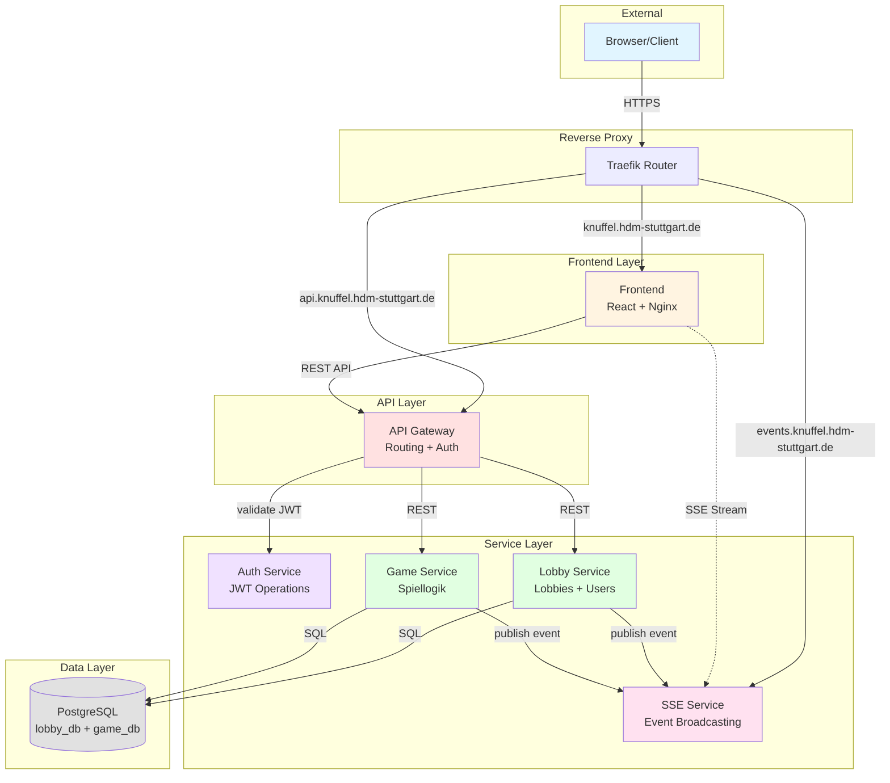

# KnuffelGame - Ein Multiplayer Kniffel Klon

Willkommen zum KnuffelGame! Dieses Projekt ist eine webbasierte Multiplayer-Variante des klassischen Würfelspiels Kniffel (oder Yahtzee), entwickelt als Microservices-Anwendung. Es dient als Demonstration für moderne Web-Architekturkonzepte.

## Inhaltsverzeichnis

1.  [Architektur](#1-architektur)
2.  [Services im Detail](#2-services-im-detail)
    - [Frontend](#frontend)
    - [API Gateway](#api-gateway)
    - [Auth Service](#auth-service)
    - [Lobby Service](#lobby-service)
    - [Game Service](#game-service)
    - [SSE Service](#sse-service)
3.  [Technologie-Stack](#3-technologie-stack)
4.  [Lokales Development](#4-lokales-development)
    - [Voraussetzungen](#voraussetzungen)
    - [Einrichtung](#einrichtung)
    - [Starten](#starten)
5.  [Projektstruktur](#5-projektstruktur)
6.  [Coding Style](#6-coding-style)

---

## 1. Architektur

Das Projekt folgt einer Microservices-Architektur, um eine klare Trennung der Verantwortlichkeiten, Skalierbarkeit und Wartbarkeit zu gewährleisten.

### Komponenten & Kommunikation



-   **Client:** Eine in React geschriebene Single-Page-Application, die mit dem Backend über eine REST-API und einen SSE-Stream kommuniziert.
-   **API Gateway:** Zentraler Router für REST-Aufrufe. Er validiert JWTs für REST über den Auth-Service und leitet die Anfrage mit angereicherten Headern (`X-User-ID`, `X-Username`) an den passenden Service weiter. Die SSE-Authentifizierung wird nicht über das Gateway vermittelt; sie erfolgt direkt im SSE-Service gegen den Auth-Service (POST `/internal/validate`) via JWTCookie.
-   **Backend Services:** Unabhängige Go-Anwendungen, die jeweils eine spezifische Geschäftslogik kapseln.
-   **Datenbank:** Eine PostgreSQL-Instanz, die die Daten für den Lobby- und Game-Service speichert.
-   **Real-Time Events:** Der SSE-Service stellt einen einzigen öffentlichen Stream bereit: `GET /events/lobby/{lobby_id}` (UUID v4). Adressierung ausschließlich über `lobby_id`. Authentifizierung via JWTCookie; Validierung direkt im SSE-Service gegen den Auth-Service (POST `/internal/validate`). Mitgliedschaftsprüfung über LobbyService (`GET /internal/lobbies/{lobby_id}`, ohne Auth): 404 wenn Lobby fehlt, 403 wenn kein Mitglied. Keep-alive pro Verbindung alle 30s; keine `retry`-Direktive. `event_type` ist frei (1–128 Zeichen), `keep_alive` ist reserviert. `data` ist immer ein JSON-Objekt; `data.timestamp` wird serverseitig als Unix-Epoch Millisekunden (Zahl) gesetzt/überschrieben. Rate-Limits im MVP deaktiviert.

---

## 2. Services im Detail

### Frontend

-   **Verantwortlichkeit:** Stellt die Benutzeroberfläche für das gesamte Spiel bereit, einschließlich Startseite, Lobby und Spielbrett.
-   **Technologie:** React, TypeScript, Vite.
-   **Kommunikation:**
    -   Sendet Benutzeraktionen (z.B. Würfeln) als REST-Aufrufe an das API Gateway.
    -   Empfängt Live-Updates (z.B. Züge anderer Spieler) über eine dauerhafte SSE-Verbindung zum SSE-Service.

### API Gateway

-   **Verantwortlichkeit:** Dient als zentraler Router und Wächter für das Backend. Es validiert die JWT-Authentifizierung jedes ankommenden REST-Aufrufs über den Auth-Service und leitet die Anfrage mit angereicherten Headern (`X-User-ID`, `X-Username`) an den passenden Downstream-Service weiter.
-   **Technologie:** Go.
-   **Spezifikation:** [`openapi.yaml`](./backend/services/APIGateway/openapi.yaml)

### Auth Service

-   **Verantwortlichkeit:** Ein stateless Service, der ausschließlich für die Erstellung und Validierung von HS256-signierten JSON Web Tokens (JWT) zuständig ist. Er bietet interne Endpunkte, die vom API Gateway aufgerufen werden.
-   **Technologie:** Go, `golang-jwt/jwt`.
-   **Spezifikation:** [`openapi.yaml`](./backend/services/AuthService/openapi.yaml)

### Lobby Service

-   **Verantwortlichkeit:** Verwaltet den Lebenszyklus von Spiellobbys. Dies umfasst das Erstellen, Beitreten, und Verwalten von Lobbys, die Generierung von Join-Codes sowie die Verwaltung der Spieler innerhalb einer Lobby. Wenn ein Spiel gestartet wird, initiiert der Lobby-Service die Erstellung des Spiels im Game-Service und publiziert Events an den SSE-Service.
-   **Technologie:** Go, PostgreSQL.
-   **Spezifikation:** [`openapi.yaml`](./backend/services/LobbyService/openapi.yaml)

### Game Service

-   **Verantwortlichkeit:** Kapselt die gesamte Spiellogik von Kniffel. Er verwaltet den Spielzustand, die Würfelmechanik (würfeln, fixieren), die Punkteberechnung und die Zugreihenfolge. Jede Aktion eines Spielers wird hier validiert, verarbeitet und der neue Zustand persistiert. Anschließend werden Events über den SSE-Service an die Spieler verteilt.
-   **Technologie:** Go, PostgreSQL.
-   **Spezifikation:** [`openapi.yaml`](./backend/services/GameService/openapi.yaml)

### SSE Service

-   **Verantwortlichkeit:** Echtzeit-Streaming-Layer mit einem einzigen öffentlichen Stream für Lobby-Zuschauer.
    - Einziger öffentlicher Stream: `GET /events/lobby/{lobby_id}` (UUID v4)
    - Event-Verteilung ausschließlich über `lobby_id`
    - `event_type` frei (1–128 Zeichen), `keep_alive` vom Service reserviert
    - `data` ist immer ein JSON-Objekt; `timestamp` (Unix-Epoch Millisekunden, Zahl) wird serverseitig gesetzt/überschrieben
    - Keep-alive pro Verbindung alle 30s; keine `retry`-Direktive
    - JWT-Validierung direkt gegen AuthService (POST `/internal/validate`) via Cookie `jwt`
    - Mitgliedschaftsprüfung über LobbyService `GET /internal/lobbies/{lobby_id}` (ohne Auth): 404 wenn Lobby fehlt, 403 wenn kein Mitglied
    - Interne Endpunkte nur: `POST /internal/publish`, `GET /healthcheck` (keine register/unregister/connections)
-   **Technologie:** Go.
-   **Spezifikation:** [`openapi.yaml`](./backend/services/SSEService/openapi.yaml)
-   **Weitere Details:** [`README.md`](./backend/services/SSEService/README.md)

---

## 3. Technologie-Stack

-   **Backend:** Go
-   **Frontend:** React, TypeScript, Vite
-   **Datenbank:** PostgreSQL
-   **Echtzeit-Kommunikation:** Server-Sent Events (SSE)
-   **API-Stil:** RESTful
-   **Authentifizierung:** JWT-basierte Gast-Sessions (via HTTP-Only-Cookies)
-   **Containerisierung:** Docker, Docker Compose
-   **API-Spezifikation:** OpenAPI 3.x
-   **Code-Stil & Konventionen:** Detailliert in [`CODING_STYLE.md`](./CODING_STYLE.md)

---

## 4. Lokales Development

### Voraussetzungen

-   Docker & Docker Compose
-   `npm` oder ein kompatibler Node.js-Paketmanager
-   Ein Texteditor (z.B. VS Code, GoLand)

### Einrichtung

1.  **Repository klonen:**
    ```sh
    git clone <repository-url>
    cd KnuffelGame
    ```

2.  **Umgebungsvariablen konfigurieren:**
    Das Projekt verwendet `.env`-Dateien zur Konfiguration der Services. Kopieren Sie die Beispiel-Dateien und passen Sie sie bei Bedarf an. Für den Standard-Start sind keine Änderungen nötig.

    ```sh
    cp env.d/AuthService.env.example env.d/AuthService.env
    cp env.d/LobbyService.env.example env.d/LobbyService.env
    cp env.d/Postgres.env.example env.d/Postgres.env
    ```

### Starten

Starten Sie das gesamte System mit einem einzigen Docker-Compose-Befehl:

```sh
docker-compose up --build
```

-   `--build`: Erzwingt den Neu-Bau der Service-Images, falls sich der Code geändert hat.
-   `-d`: (Optional) Startet die Container im Hintergrund.

Nach dem Start sind die Services unter folgenden Ports auf `localhost` erreichbar:

| Service | Port | URL |
|---|---|---|
| **Frontend** | `3000` | http://localhost:3000 |
| **API Gateway** | `8080` | http://localhost:8080 |
| **Auth Service** | `8081` | http://localhost:8081 |
| **Game Service** | `8082` | http://localhost:8082 |
| **Lobby Service** | `8083` | http://localhost:8083 |
| **SSE Service** | `8084` | http://localhost:8084 |
| **PostgreSQL** | `5432` | (Nur intern erreichbar) |

---

## 5. Projektstruktur

Das Projekt ist als Monorepo organisiert, um die Verwaltung der verschiedenen Services zu vereinfachen.

```
KnuffelGame/
├── backend/
│   ├── libs/             # Geteilte Go-Bibliotheken (Logger, HTTP-Utils, etc.)
│   └── services/         # Einzelne Microservices (Auth, Lobby, etc.)
├── database/             # DB-Initialisierungsskripte
├── env.d/                # .env-Dateien und Beispiele
├── knuffel-frontend/     # React-Frontend-Anwendung
└── docker-compose.yaml   # Orchestrierung für lokales Development
```

-   **`backend/libs`**: Enthält wiederverwendbare Go-Module, die von mehreren Services genutzt werden. Jede Bibliothek hat ihr eigenes `go.mod` und wird über `replace`-Direktiven in den Services eingebunden.
-   **`backend/services`**: Jeder Unterordner repräsentiert einen eigenständigen Microservice mit seiner eigenen `main.go`, `Dockerfile` und `openapi.yaml`-Spezifikation.
-   **`knuffel-frontend`**: Eine Standard-Vite/React-Anwendung.

---

## 6. Coding Style

Das Projekt folgt einem strikten Coding-Style-Guide, um Konsistenz und Lesbarkeit im Go-Backend sicherzustellen. Alle Details zu Projektstruktur, Naming Conventions, Error Handling und Architekturmustern sind im folgenden Dokument definiert:

➡️ **[CODING_STYLE.md](./CODING_STYLE.md)**

Dieses Dokument ist eine verbindliche Referenz für alle Backend-Entwicklungen.
