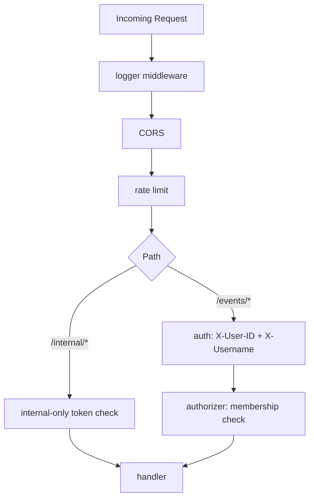
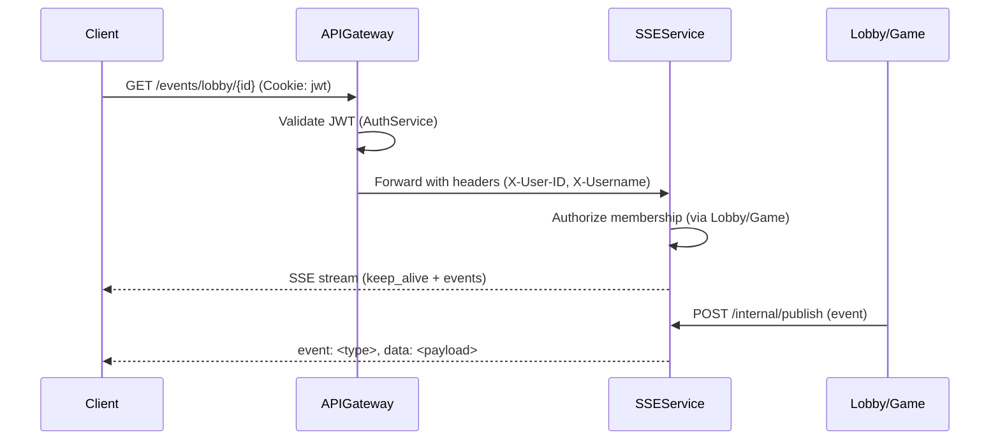

# SSE Service

Implementation-ready architecture blueprint for the Server-Sent Events (SSE) service powering lobby and game updates in Knuffel.

References:
- OpenAPI: [openapi.yaml](backend/services/SSEService/openapi.yaml)
- Router skeleton: [internal/router.go](backend/services/SSEService/internal/router.go)
- Shared libs: [backend/libs/auth](backend/libs/auth/auth.go), [backend/libs/httpx](backend/libs/httpx/httpx.go), [backend/libs/logger](backend/libs/logger/middleware.go), [backend/libs/healthcheck](backend/libs/healthcheck/healthcheck.go)
- Service entrypoint: [cmd/SSEService/main.go](backend/services/SSEService/cmd/SSEService/main.go)

## Overview and Responsibilities (aligned to OpenAPI)

The SSEService is a stateless streaming layer providing:
- SSE subscriptions for lobby and game audiences
- Central broadcasting of events published by LobbyService and GameService
- Connection lifecycle management and heartbeat keep-alives
- Internal admin endpoints for registration/unregistration and connection stats
- Healthcheck endpoint

Endpoints per spec:
- GET /events/lobby/{lobby_id}
- GET /events/game/{game_id}
- POST /internal/publish
- POST /internal/register
- POST /internal/unregister
- GET /internal/connections
- GET /healthcheck

See OpenAPI details: [backend/services/SSEService/openapi.yaml](backend/services/SSEService/openapi.yaml).

## Architecture and Streaming Model

### Core streaming engine
- Library: r3labs/sse (server)
- Stream naming:
  - Broadcast streams:
    - lobby:{lobby_id}
    - game:{game_id}
  - Targeted user scoping is supported in payload via `target_user_id` (clients should ignore events not addressed to them). For strict per-user isolation, a secondary subscription pattern using dedicated streams lobby:{lobby_id}:user:{user_id} and game:{game_id}:user:{user_id} is supported as an extension; clients may open a second EventSource to these streams when needed.

### Event formatting
- SSE fields:
  - event: <event_type> (string, per spec)
  - data: <json> (serialized payload)
- Types per spec:
  - Lobby: player_joined, player_left, player_kicked, leader_changed, game_started, keep_alive
  - Game: dice_rolled, dice_toggled, field_selected, turn_changed, player_inactive, player_active, game_ended, keep_alive
- Payload: JSON object (additionalProperties allowed)

### Heartbeat keep-alive
- Interval: configurable (default 30s)
- Event: event=keep_alive, data={"timestamp":"<RFC3339>"}
- Purpose: prevent intermediary idle timeouts and guide client-side reconnect.
- Publisher: background goroutines per-target stream (started on register or first subscription, stopped on unregister).

### SSE response headers and handling
- Required headers:
  - Content-Type: text/event-stream
  - Cache-Control: no-cache
  - Connection: keep-alive
- Flush:
  - Use http.Flusher for immediate delivery. The r3labs server handles flushing internally; custom handlers must verify Flusher presence and use it.
- Retry:
  - Optionally set "retry: 5000" lines at stream start to tell clients a 5s reconnect interval. Heartbeats reduce unnecessary reconnects.

## SSE Connection Registry

### Purpose
An in-memory, concurrency-safe registry tracks per-target stream metadata, active connection counters, and lifecycle hooks. The data is used for pruning, stats, and emitting lifecycle logs.

### Keying strategy
- Key: target composite string "lobby:{lobby_id}" or "game:{game_id}".
- Optional per-user extension streams: append ":user:{user_id}" for targeted isolation (documented for future strict privacy requirements).

### Data structures
Typed maps with RWMutex:
- targets map[string]*TargetEntry
- TargetEntry:
  - Type: "lobby" | "game"
  - ID: string
  - StreamName: string
  - Connections: int (approximate active subscribers)
  - CreatedAt: time.Time
  - LastPublishAt: time.Time
  - HeartbeatCancel: context.CancelFunc (to stop heartbeat goroutine)
  - Metrics: counters for events_sent, failed_connections (incremented on publish)

### Concurrency approach and trade-offs
- RWMutex over typed maps:
  - Pros: predictable performance for frequent reads (publish, stats), clear ownership, minimizes allocations.
  - Cons: manual lock discipline.
- sync.Map alternative:
  - Pros: simpler sharding-free concurrency, good for highly contested keys.
  - Cons: reduced type safety, heavier allocations, more awkward stats iteration.
- Decision: use sync.RWMutex with typed maps. Keys are stable; registry size remains small; iteration for stats is straightforward.

### Lifecycle hooks
- RegisterTarget: create TargetEntry and r3labs stream if absent; start heartbeat goroutine.
- AddConnection: increment Connections and log.
- RemoveConnection: decrement on disconnect (via request context cancel).
- Publish: send r3labs event to stream; increment metrics (events_sent, failed_connections if publish returns error).
- UnregisterTarget: publish a final close event with reason, stop heartbeat, remove stream and registry entry; return connections_closed count.

### Broken-connection pruning
- Clients disconnect automatically; RemoveConnection updates counts using r.Context().Done().
- Publish failures lead to metrics increments and potential log warnings. r3labs server cleans internal subscribers; registry counters capture approximations, not exact low-level channel states.

## Endpoints and Handlers

### Public SSE subscriptions
- GET /events/lobby/{lobby_id}
- GET /events/game/{game_id}
Auth and authorization:
- JWT cookie auth at gateway; SSEService consumes user context via headers:
  - Requires X-User-ID and X-Username from APIGateway (libs/auth middleware).
  - SSEService verifies membership via an authorizer calling APIGateway/Lobby/Game Service (see Authorizer middleware below).
Behavior:
- On subscribe:
  - Validate path ID format (per OpenAPI).
  - Extract user via [backend/libs/auth](backend/libs/auth/auth.go).
  - Authorize membership (must be in lobby/game).
  - Register stream if not present; increment connection counter; log lifecycle.
  - Attach client to r3labs server stream; set headers; start delivery.
- Heartbeat:
  - Periodic keep_alive emitted by target-level goroutine (not per-connection).
- Auto-cleanup:
  - On r.Context().Done(), decrement counter; log disconnect; no server-wide side effects.
- Reconnection guidance:
  - Clients should use exponential backoff; server emits heartbeats to keep intermediaries alive.
  - Optionally provide "retry: 5000" SSE directive at stream start.

Errors:
- 401 unauthorized (missing/invalid user context at gateway)
- 403 forbidden (not in lobby/game)
- 404 not found (target not registered or not found via authorizer)
- Error payloads standardized via [backend/libs/httpx](backend/libs/httpx/httpx.go)

### Internal endpoints (protected)
- POST /internal/publish
  - Body: PublishEventRequest
  - Behavior: find target entry; if target_user_id set, include in payload; broadcast via r3labs to stream; respond with counters: connections_found (registry count), events_sent, failed_connections.
- POST /internal/register
  - Pre-create target stream and registry entry (optional; first subscription also auto-creates).
- POST /internal/unregister
  - Send close event with reason to clients; stop heartbeat; remove stream and registry entry; return connections_closed.
- GET /internal/connections
  - Return stats: totals by lobbies/games and timestamp.

- GET /healthcheck
  - Mounted via [backend/libs/healthcheck](backend/libs/healthcheck/healthcheck.go).

### Middleware stack and routing

Router wiring: [internal/router.go](backend/services/SSEService/internal/router.go)

Middleware chain:
- logger.ChiMiddleware for structured request logs: [backend/libs/logger/middleware.go](backend/libs/logger/middleware.go)
- Request ID correlation supplied by logger middleware
- CORS via go-chi/cors (allow EventSource with credentials)
- Rate limiting via go-chi/httprate
  - Public SSE endpoints exempt or set to very high limits
  - Internal endpoints limited (e.g., 60 req/min per IP)
- Internal-only auth (X-Internal-Token matched to env SSE_INTERNAL_TOKEN) for /internal routes
- Auth middleware (libs/auth) to read user headers (X-User-ID, X-Username)
- Authorizer middleware calling APIGateway/Lobby/Game services to ensure membership

Mermaid (middleware chain):



## Error Model and httpx integration

Standardized error JSON envelopes using [backend/libs/httpx](backend/libs/httpx/httpx.go):
- 400 bad_request: invalid_request details when input invalid
- 401 unauthorized: missing/invalid context from gateway
- 403 forbidden: not a member of target
- 404 not_found: target not registered or not found
- 409 conflict: used when lifecycle conflicts arise (e.g., already_exists on register)
- 500 internal_error: unexpected failures

Examples (payloads align with OpenAPI components/schemas/ErrorResponse):
```json
{"error":"unauthorized","message":"Invalid or expired authentication token"}
{"error":"forbidden","message":"You are not a member of this lobby"}
{"error":"target_not_found","message":"No active connections for target"}
```

## Configuration Model

Environment variables (documented; see [env.d/SSEService.env.example](env.d/SSEService.env.example)):
- PORT: service port, default 8084
- SERVICE_NAME: SSEService
- LOG_LEVEL: debug|info|warn|error
- LOG_COLOR: true|false
- CORS_ALLOW_ORIGINS: comma-separated origins (e.g., https://knuffel.uni.de,http://localhost:5173)
- CORS_ALLOW_HEADERS: defaults include Content-Type, Cookie, X-Request-ID
- CORS_ALLOW_METHODS: GET, POST, OPTIONS
- CORS_ALLOW_CREDENTIALS: true|false
- RATE_LIMIT_INTERNAL_PER_MINUTE: default 60
- RATE_LIMIT_SSE_PER_MINUTE: default 0 (disabled/exempt) or very high (e.g., 10000)
- JWT_COOKIE_NAME: cookie name used by gateway, default "jwt"
- SSE_INTERNAL_TOKEN: shared secret for /internal (header X-Internal-Token)
- HEARTBEAT_INTERVAL_MS: default 30000

Placement: [env.d/SSEService.env.example](env.d/SSEService.env.example)

## Security Model

- Public SSE endpoints:
  - JWTCookie enforced by APIGateway; SSEService consumes X-User-ID and X-Username headers via [backend/libs/auth](backend/libs/auth/auth.go).
- Internal endpoints:
  - Shared secret header X-Internal-Token must match SSE_INTERNAL_TOKEN.
  - Future: mTLS option between internal services; document and gate via reverse proxy or middleware.

## Logging and Observability

Structured logs via [backend/libs/logger](backend/libs/logger/middleware.go):
- Emit: http.method, http.path, http.status, http.duration_ms, http.request_id, http.remote_ip, http.user_agent
- SSE lifecycle logs:
  - connect: target_type, target_id, user_id
  - disconnect: target_type, target_id, user_id, duration_ms
  - publish: target_type, target_id, event_type, events_sent, failed_connections
  - unregister: reason, connections_closed
- Correlate with X-Request-ID where available.

## Reconnect Logic Expectations

Clients:
- Use EventSource with automatic reconnect.
- Implement exponential backoff (e.g., initial 1s, cap 30s).
- Keep connection alive via server heartbeats (keep_alive).
- Optional server-provided "retry" directive; clients may choose to honor or override.

Server:
- Heartbeats emitted every HEARTBEAT_INTERVAL_MS.
- Close events sent on unregister to hint clients to stop retrying for a target.

## File and Package Layout Plan

Create or extend the following files to implement the design:

- [cmd/SSEService/main.go](backend/services/SSEService/cmd/SSEService/main.go): bootstrap, config load, logger init, router init, server start
- [internal/router.go](backend/services/SSEService/internal/router.go): chi router wiring, middleware application, route groups
- [internal/models/config.go](backend/services/SSEService/internal/models/config.go): config struct and env binding
- [internal/models/registry.go](backend/services/SSEService/internal/models/registry.go): registry types and methods (typed maps with RWMutex)
- [internal/middleware/auth.go](backend/services/SSEService/internal/middleware/auth.go): header-based auth via libs/auth (X-User-ID/X-Username)
- [internal/middleware/authorizer.go](backend/services/SSEService/internal/middleware/authorizer.go): membership checks against Lobby/Game via APIGateway
- [internal/middleware/http.go](backend/services/SSEService/internal/middleware/http.go): CORS and rate-limiting policies
- [internal/middleware/internal_only.go](backend/services/SSEService/internal/middleware/internal_only.go): internal header secret check
- [internal/handlers/events_lobby.go](backend/services/SSEService/internal/handlers/events_lobby.go): SSE handler for lobby
- [internal/handlers/events_game.go](backend/services/SSEService/internal/handlers/events_game.go): SSE handler for game
- [internal/handlers/publish.go](backend/services/SSEService/internal/handlers/publish.go): broadcast handler
- [internal/handlers/register.go](backend/services/SSEService/internal/handlers/register.go): pre-create stream/registry slot
- [internal/handlers/unregister.go](backend/services/SSEService/internal/handlers/unregister.go): close connections, send close event, remove entry
- [internal/handlers/stats.go](backend/services/SSEService/internal/handlers/stats.go): connection stats
- [internal/handlers/errors.go](backend/services/SSEService/internal/handlers/errors.go): centralized error helpers using httpx

## SSE Headers and Response Handling

On subscription:
- Set headers:
  - Content-Type: text/event-stream
  - Cache-Control: no-cache
  - Connection: keep-alive
- Ensure http.Flusher present; flush initial comment and optional `retry` directive.

Keep-alive format (every 30s default):
```
event: keep_alive
data: {"timestamp":"2025-10-24T10:30:00Z"}
```

## Client Examples

Browser (EventSource):

```js
const lobbyId = "lby_abc123";
const source = new EventSource(`/events/lobby/${lobbyId}`, { withCredentials: true });

source.addEventListener("keep_alive", (e) => {
  const payload = JSON.parse(e.data);
  console.debug("heartbeat", payload);
});

source.addEventListener("player_joined", (e) => {
  const payload = JSON.parse(e.data);
  // render UI update
});

source.onerror = (err) => {
  console.warn("SSE error", err);
  // EventSource auto-reconnects; consider UI notice
};
```

Node (eventsource package):

```js
import EventSource from "eventsource";
const gameId = "gam_xyz789";
const es = new EventSource(`http://localhost:8084/events/game/${gameId}`, { headers: { Cookie: "jwt=..." } });

es.addEventListener("turn_changed", (e) => {
  const payload = JSON.parse(e.data);
  // handle turn change
});

es.addEventListener("keep_alive", (e) => {
  // log heartbeat
});

es.onerror = (err) => {
  console.error("SSE error", err);
  // auto-reconnect via library defaults or implement backoff if needed
};
```

Reconnect/backoff guidance:
- EventSource will retry automatically; clients can wrap with backoff when using custom libraries.
- Server may emit `retry: 5000` at stream start as a hint.

## Operational Notes

- Rate limits:
  - Internal endpoints: 60 req/min/IP (configurable)
  - SSE endpoints: exempt or very high limit (to avoid disconnects on long-lived connections)
- CORS:
  - Allow configured origins, credentials=true for cookie-based auth
  - Allow methods GET, POST, OPTIONS; Allow headers Content-Type, Cookie, X-Request-ID
- Internal auth:
  - Require X-Internal-Token header on /internal; compare to SSE_INTERNAL_TOKEN
- Observability:
  - Structured logs via libs/logger; ensure request_id correlation
  - Metrics counters inside registry; consider future Prometheus integration

Mermaid (request flow):



## Testing Strategy

Unit tests:
- Registry: add/register/unregister, counters, heartbeat start/stop, publish counters
- Handlers: input validation, error responses via httpx, internal token protection

Integration tests:
- Simulate multiple SSE clients across lobbies/games
- Publish flows (broadcast + target_user_id)
- Unregister closes and removes registry; clients receive close event
- Reconnection behavior: clients reconnect after transient disconnect; heartbeat prevents idle timeouts

Test layout:
- Place tests under [backend/services/SSEService/internal](backend/services/SSEService/internal) mirroring handlers and models.

## Implementation Notes and TODOs

- Use r3labs/sse.Server with per-target streams; mount server handler under /events/* routes via a custom wrapper that sets headers and increments/decrements registry counters on connect/disconnect using r.Context().Done().
- Authorizer middleware calls APIGateway/Lobby/Game (HTTP) to confirm membership; cache positive checks briefly if needed.
- Consider future strict per-user isolation via secondary per-user streams; current design includes target_user_id filtering in payload for simplicity.

## Build and Run

Build:
```bash
go build -o sse-service ./cmd/SSEService
```

Run:
```bash
PORT=8084 LOG_LEVEL=info SSE_INTERNAL_TOKEN=change_me ./sse-service
```

Healthcheck:
```bash
curl http://localhost:8084/healthcheck
# {"status":"ok"}
```

## OpenAPI Specification

See [openapi.yaml](backend/services/SSEService/openapi.yaml) for detailed endpoints and schemas.