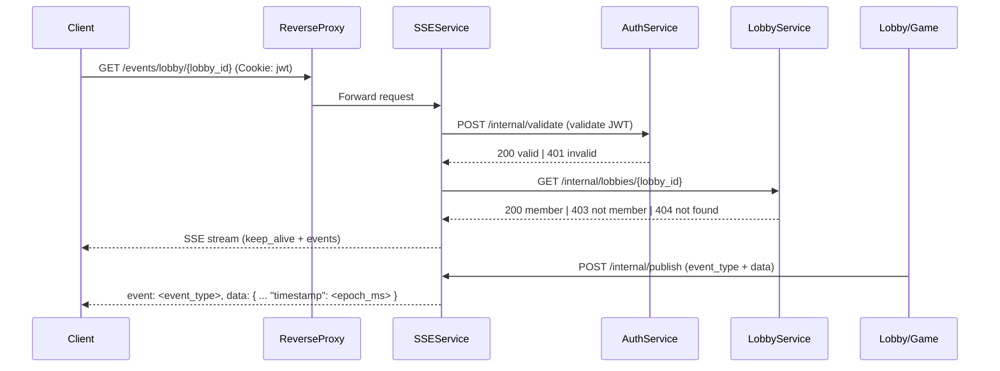

# SSE Service

Implementation-ready architecture blueprint for the Server-Sent Events (SSE) service powering lobby updates in Knuffel.

References:
- OpenAPI: [openapi.yaml](backend/services/SSEService/openapi.yaml)
- Router skeleton: [internal/router.go](backend/services/SSEService/internal/router.go)
- Shared libs: [backend/libs/auth](backend/libs/auth/auth.go), [backend/libs/httpx](backend/libs/httpx/httpx.go), [backend/libs/logger](backend/libs/logger/middleware.go), [backend/libs/healthcheck](backend/libs/healthcheck/healthcheck.go)
- Service entrypoint: [cmd/SSEService/main.go](backend/services/SSEService/cmd/SSEService/main.go)

## Overview and Responsibilities (aligned to OpenAPI)

The SSEService is a stateless streaming layer providing:
- Single SSE subscription stream addressed strictly by lobby_id
- Central broadcasting of events published by LobbyService and GameService via a single internal publish endpoint
- Connection lifecycle management and per-connection heartbeat keep-alives
- Healthcheck endpoint

Semantics:
- event_type is free-form, non-empty, up to 128 characters. Example types include: lobby_updated, game_updated. The event_type keep_alive is reserved by the SSEService and cannot be published by producers.
- data is always a JSON object. The SSEService injects/overwrites data.timestamp on every event with a Unix epoch milliseconds number (field name "timestamp").

Server URL: http://localhost:8084

Endpoints per spec:
- GET /events/lobby/{lobby_id}
- POST /internal/publish
- GET /healthcheck

See OpenAPI details: [backend/services/SSEService/openapi.yaml](backend/services/SSEService/openapi.yaml).

## Architecture and Streaming Model

### Core streaming engine
- Library: r3labs/sse (server)
- Stream naming:
  - Broadcast streams:
    - lobby:{lobby_id}
- Addressing strictly via lobby_id. No per-user addressing and no game stream.

### Event formatting
- SSE fields:
  - event: <event_type> (string, free-form 1–128 chars; keep_alive is reserved by the service)
  - data: <json> (serialized JSON object)
- Example event_type values: lobby_updated, game_updated (free-form, not enforced). keep_alive is reserved and emitted by the service only.
- Payload: JSON object. The SSEService injects/overwrites data.timestamp as a Unix epoch milliseconds number on each event (including keep_alive).

### Heartbeat keep-alive
- Interval: configurable (default 30s), see HEARTBEAT_INTERVAL_MS.
- Scope: per-connection (each active connection receives its own heartbeat).
- Event: event=keep_alive, data={"timestamp": 1733220000000} (numeric epoch ms).
- Purpose: prevent intermediary idle timeouts and provide a liveness signal.
- No retry directive: the service does not emit an initial retry line (no retry: N directive).

### SSE response headers and handling
- Required headers:
  - Content-Type: text/event-stream
  - Cache-Control: no-cache
  - Connection: keep-alive
- Flush:
  - Use http.Flusher for immediate delivery. The r3labs server handles flushing internally; custom handlers must verify Flusher presence and use it.
- Retry:
  - The service does not emit an initial retry directive. Clients manage reconnection behavior.

## SSE Connection Registry

### Purpose
An in-memory, concurrency-safe registry tracks per-lobby stream metadata, approximate active connection counters, and metrics to aid observability.

### Keying strategy
- Key: target composite string "lobby:{lobby_id}".

### Data structures
Typed maps with RWMutex (illustrative):
- targets map[string]*TargetEntry
- TargetEntry:
  - ID: string
  - StreamName: string
  - Connections: int (approximate active subscribers)
  - CreatedAt: time.Time
  - LastPublishAt: time.Time
  - Metrics: counters for events_sent, failed_connections (incremented on publish)

### Lifecycle semantics
- Implicit registry:
  - Entries are created implicitly on the first subscription to a lobby.
  - Entries are removed automatically when the last connection ends.
- AddConnection: increment counters and log on connect.
- RemoveConnection: decrement on disconnect (via request context cancel).
- Publish: send r3labs event to stream; increment metrics (events_sent, failed_connections if publish returns error).
- No explicit lifecycle endpoints:
  - There are no /internal/register, /internal/unregister, or /internal/connections endpoints in the MVP.

### Broken-connection pruning
- Clients disconnect automatically; RemoveConnection updates counts using r.Context().Done().
- Publish failures lead to metrics increments and potential log warnings. r3labs server cleans internal subscribers; registry counters capture approximations, not exact low-level channel states.

## Endpoints and Handlers

### Public SSE subscriptions
- GET /events/lobby/{lobby_id}

Auth and authorization:
- JWT via cookie on the subscription endpoint (operation-level JWTCookie security in OpenAPI).
- SSEService validates the JWT directly with AuthService via POST /internal/validate.
- Membership is verified by calling LobbyService GET /internal/lobbies/{lobby_id} (no auth) to confirm lobby existence and that the user is a member.
  - 404 if the lobby does not exist
  - 403 if the user is not a member

Behavior:
- On subscribe:
  - Validate path ID format (UUID v4).
  - Read the JWT from the configured cookie and validate via AuthService (POST /internal/validate).
  - Call LobbyService (GET /internal/lobbies/{lobby_id}) to confirm membership.
  - Attach client to the r3labs server stream for lobby:{lobby_id}; set headers; start delivery.
- Heartbeat:
  - Per-connection keep_alive is emitted every HEARTBEAT_INTERVAL_MS (default 30s).
- Auto-cleanup:
  - On r.Context().Done(), decrement counters; log disconnect; remove registry entry when the last connection ends.
- Reconnection guidance:
  - Clients should implement exponential backoff if desired. The service does not emit an SSE retry directive.

Errors:
- 401 unauthorized (missing/invalid JWT cookie or token validation failed)
- 403 forbidden (user is not a member of the target lobby)
- 404 not found (lobby not found)
- Error payloads standardized via [backend/libs/httpx](backend/libs/httpx/httpx.go)

### Internal endpoints
- POST /internal/publish
  - Body (JSON):
    - lobby_id: string (uuid)
    - event_type: string (1–128 chars, must not be "keep_alive")
    - data?: object
  - Rules:
    - Reject event_type "keep_alive" with 400 invalid_request.
    - Reject non-object data with 400 invalid_request.
    - On publish:
      - If data is missing, create {"timestamp": <epoch_ms>}.
      - If data is present, overwrite data.timestamp with <epoch_ms>.
    - Unknown lobby: 404 target_not_found.
    - No active connections for the lobby: still respond 200 with success=true and zero counters (connections_found=0, events_sent=0).
- GET /healthcheck
  - Mounted via [backend/libs/healthcheck](backend/libs/healthcheck/healthcheck.go).

### Middleware stack and routing

Router wiring: [internal/router.go](backend/services/SSEService/internal/router.go)

Middleware chain (conceptual):
- logger.ChiMiddleware for structured request logs: [backend/libs/logger/middleware.go](backend/libs/logger/middleware.go)
- Request ID correlation (logger middleware)
- CORS via go-chi/cors (allow EventSource with credentials)
- Public SSE endpoint:
  - JWTCookie validation by SSEService via AuthService (POST /internal/validate)
  - Membership check via LobbyService (GET /internal/lobbies/{lobby_id})
- Internal endpoints:
  - No application-layer auth documented (isolated by reverse proxy in deployment)

Mermaid (middleware chain):

```mermaid
graph TD
    A[Incoming Request] --> B[logger middleware]
    B --> C[CORS]
    C --> D{Path}
    D -->|/events/lobby/{id}| E[validate JWT via AuthService]
    E --> F[authorize membership via LobbyService]
    F --> G[handler]
    D -->|/internal/*| G[handler]
```

## Error Model and httpx integration

Standardized error JSON envelopes using [backend/libs/httpx](backend/libs/httpx/httpx.go):
- 400 bad_request: invalid_request details when input invalid (e.g., event_type "keep_alive", non-object data)
- 401 unauthorized: invalid or expired authentication token
- 403 forbidden: not a member of the lobby
- 404 not_found: lobby not found (subscription) or target_not_found (publish)
- 500 internal_error: unexpected failures

Examples (payloads align with OpenAPI components/schemas/ErrorResponse):
```json
{"error":"unauthorized","message":"Invalid or expired authentication token"}
{"error":"forbidden","message":"You are not a member of this lobby"}
{"error":"target_not_found","message":"No active connections for target"}
```

## Configuration Model

Environment variables (documented; see [env.d/SSEService.env.example](env.d/SSEService.env.example)):
- PORT: service port, default 8084
- SERVICE_NAME: SSEService
- LOG_LEVEL: debug|info|warn|error
- LOG_COLOR: true|false
- CORS_ALLOW_ORIGINS: comma-separated origins (e.g., https://knuffel.uni.de,http://localhost:5173)
- CORS_ALLOW_HEADERS: e.g., Content-Type, Cookie, X-Request-ID
- CORS_ALLOW_METHODS: GET, POST, OPTIONS
- CORS_ALLOW_CREDENTIALS: true|false
- JWT_COOKIE_NAME: cookie name for JWT, default "jwt"
- HEARTBEAT_INTERVAL_MS: default 30000 (keep-alive is per-connection)
- Note: Rate limits are disabled in the MVP.

Placement: [env.d/SSEService.env.example](env.d/SSEService.env.example)

## Security Model

- Public SSE endpoint:
  - SSE behind a reverse proxy.
  - JWT cookie is validated by the SSEService by calling AuthService (POST /internal/validate).
  - OpenAPI uses operation-level JWTCookie security on GET /events/lobby/{lobby_id}; no root-level security.
- Internal endpoints:
  - No security schemes are documented in the spec. Isolation is provided by the reverse proxy in deployment.
- Remove API Gateway-specific flows: The SSEService no longer depends on APIGateway for user context or membership checks.

## Logging and Observability

Structured logs via [backend/libs/logger](backend/libs/logger/middleware.go):
- Emit: http.method, http.path, http.status, http.duration_ms, http.request_id, http.remote_ip, http.user_agent
- SSE lifecycle logs:
  - connect: lobby_id, user_id
  - disconnect: lobby_id, user_id, duration_ms
  - publish: lobby_id, event_type, events_sent, failed_connections
- Correlate with X-Request-ID where available.

## Reconnect Logic Expectations

Clients:
- Use EventSource with automatic reconnect.
- Implement exponential backoff (e.g., initial 1s, cap 30s).
- Keep connection alive via server heartbeats (keep_alive).
- No server retry directive is emitted; clients manage backoff.

Server:
- Heartbeats emitted every HEARTBEAT_INTERVAL_MS per connection.

## File and Package Layout Plan

Implement or extend the following files based on the MVP design:

- [cmd/SSEService/main.go](backend/services/SSEService/cmd/SSEService/main.go): bootstrap, config load, logger init, router init, server start
- [internal/router.go](backend/services/SSEService/internal/router.go): chi router wiring, middleware application, route groups
- [internal/models/config.go](backend/services/SSEService/internal/models/config.go): config struct and env binding
- [internal/models/registry.go](backend/services/SSEService/internal/models/registry.go): registry types and methods (typed maps with RWMutex)
- [internal/middleware/auth.go](backend/services/SSEService/internal/middleware/auth.go): JWTCookie validation via AuthService /internal/validate
- [internal/middleware/authorizer.go](backend/services/SSEService/internal/middleware/authorizer.go): membership checks via LobbyService GET /internal/lobbies/{lobby_id}
- [internal/middleware/http.go](backend/services/SSEService/internal/middleware/http.go): CORS policies
- [internal/handlers/events_lobby.go](backend/services/SSEService/internal/handlers/events_lobby.go): SSE handler for lobby
- [internal/handlers/publish.go](backend/services/SSEService/internal/handlers/publish.go): broadcast handler
- [internal/handlers/errors.go](backend/services/SSEService/internal/handlers/errors.go): centralized error helpers using httpx

Note: There are no MVP endpoints for game subscriptions, register/unregister, or connection stats.

## SSE Headers and Response Handling

On subscription:
- Set headers:
  - Content-Type: text/event-stream
  - Cache-Control: no-cache
  - Connection: keep-alive
- Ensure http.Flusher present; flush initial comment if needed.
- Do not emit an SSE retry directive.

Keep-alive format (every 30s default):
```
event: keep_alive
data: {"timestamp": 1733220000000}
```

## Client Examples

Browser (EventSource):

```js
const lobbyId = "a8a68f18-9b1e-4d47-9b1c-1f4b0e5a2c63";
const source = new EventSource(`/events/lobby/${lobbyId}`, { withCredentials: true });

source.addEventListener("keep_alive", (e) => {
  const payload = JSON.parse(e.data);
  // data.timestamp is numeric epoch ms
  const ts = Number(payload.timestamp);
  console.debug("heartbeat", new Date(ts).toISOString(), payload);
});

source.addEventListener("lobby_updated", (e) => {
  const payload = JSON.parse(e.data);
  // data.timestamp is numeric epoch ms
  const ts = Number(payload.timestamp);
  // render UI update
  console.log("lobby_updated @", ts, payload);
});

source.addEventListener("game_updated", (e) => {
  const payload = JSON.parse(e.data);
  // data.timestamp is numeric epoch ms
  const ts = Number(payload.timestamp);
  console.log("game_updated @", ts, payload);
});

source.onerror = (err) => {
  console.warn("SSE error", err);
  // EventSource auto-reconnects; consider UI notice/backoff
};
```

Node (eventsource package):

```js
import EventSource from "eventsource";

const lobbyId = "a8a68f18-9b1e-4d47-9b1c-1f4b0e5a2c63";
// Supply cookie header with a valid JWT; URL points to SSEService directly in local dev
const es = new EventSource(`http://localhost:8084/events/lobby/${lobbyId}`, {
  headers: { Cookie: "jwt=..." },
  withCredentials: true,
});

es.addEventListener("lobby_updated", (e) => {
  const payload = JSON.parse(e.data);
  const ts = Number(payload.timestamp);
  // handle lobby update
  console.log("lobby_updated @", ts, payload);
});

es.addEventListener("game_updated", (e) => {
  const payload = JSON.parse(e.data);
  const ts = Number(payload.timestamp);
  // handle game-related update broadcast to the lobby
  console.log("game_updated @", ts, payload);
});

es.addEventListener("keep_alive", (e) => {
  const payload = JSON.parse(e.data);
  const ts = Number(payload.timestamp);
  console.log("heartbeat", ts);
});

es.onerror = (err) => {
  console.error("SSE error", err);
  // auto-reconnect via library defaults or implement backoff if needed
};
```

Reconnect/backoff guidance:
- EventSource will retry automatically; clients can wrap with additional backoff when using custom libraries.
- The service does not emit an SSE retry directive.

## Operational Notes

- Rate limits:
  - Disabled for MVP.
- CORS:
  - Configurable via environment variables (CORS_ALLOW_ORIGINS, CORS_ALLOW_METHODS, CORS_ALLOW_HEADERS, CORS_ALLOW_CREDENTIALS).
- Internal endpoints:
  - Isolated by reverse proxy; no application-layer security scheme in OpenAPI.
- Observability:
  - Structured logs via libs/logger; ensure request_id correlation
  - Metrics counters inside registry; consider future Prometheus integration

## Mermaid (request flow)



## Testing Strategy

Unit tests:
- Registry: implicit create on subscribe, removal when last connection ends, counters, publish counters
- Handlers: input validation, error responses via httpx
- Publish handler:
  - Reject event_type "keep_alive" with 400
  - Reject non-object data with 400
  - Overwrite data.timestamp with numeric epoch ms (when provided)
  - Create {"timestamp": <epoch_ms>} when data is missing
- SSE headers: correct Content-Type, Cache-Control, Connection

Integration tests:
- Subscribe to /events/lobby/{lobby_id} (no /events/game)
- Membership check via LobbyService internal endpoint (403/404 behavior)
- Publish flows (events delivered to connected clients)
- Keep-alive per-connection every 30s (assert periodic keep_alive with numeric epoch ms)
- No retry directive assertions

Test layout:
- Place tests under [backend/services/SSEService/internal](backend/services/SSEService/internal) mirroring handlers and models.

## Implementation Notes and TODOs

- Use r3labs/sse.Server with per-lobby streams; mount server handler under /events/lobby/{lobby_id} via a custom wrapper that sets headers and increments/decrements registry counters on connect/disconnect using r.Context().Done().
- Auth: validate JWTCookie via AuthService (POST /internal/validate).
- Membership: call LobbyService GET /internal/lobbies/{lobby_id}.
- No register/unregister or connections stats endpoints in MVP.
- event_type is free-form; keep_alive reserved by service.
- data is object; data.timestamp is a numeric epoch ms injected/overwritten for every event.

## Build and Run

Build:
```bash
go build -o sse-service ./cmd/SSEService
```

Run:
```bash
PORT=8084 LOG_LEVEL=info ./sse-service
```

Healthcheck:
```bash
curl http://localhost:8084/healthcheck
# {"status":"ok"}
```

## OpenAPI Specification

See [openapi.yaml](backend/services/SSEService/openapi.yaml) for detailed endpoints and schemas.